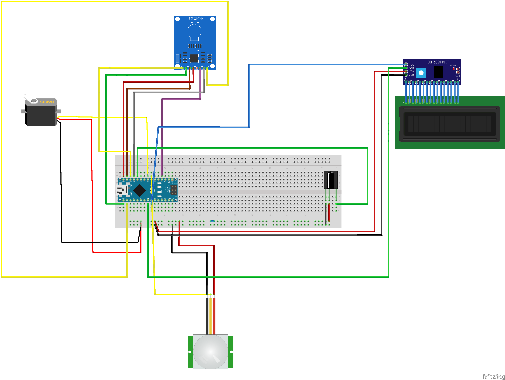
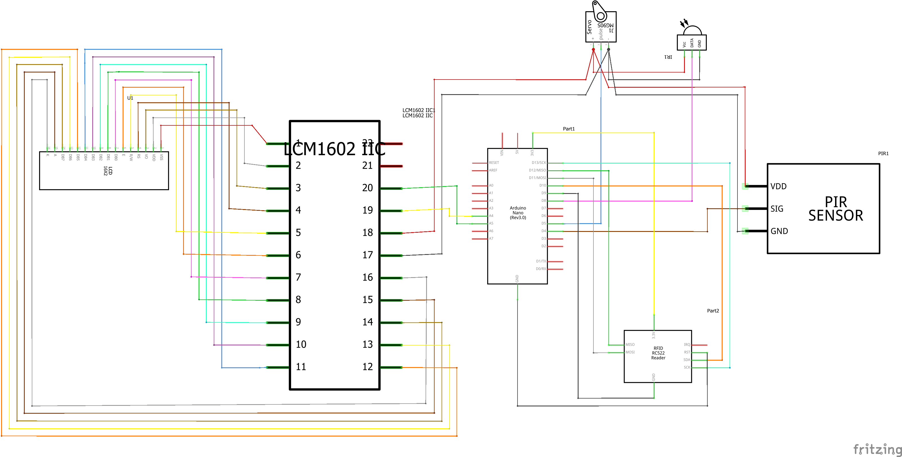
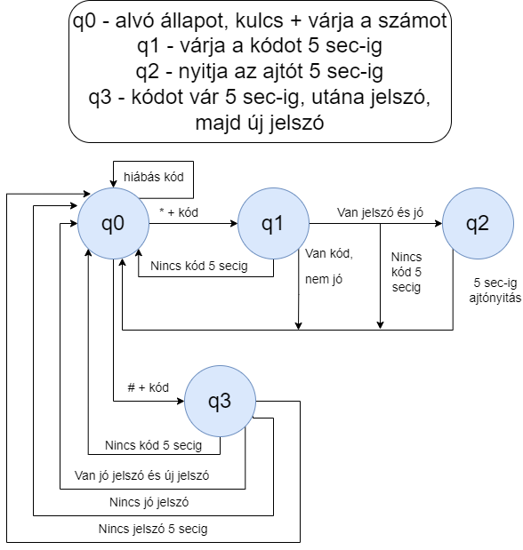

# Robotika 2023 gyakorlat Piros csapat

## Csapattagok

- Kiss Barnabás (DDWUPK)
- Kaponya Martin (SND69K)
- Mihály Balázs (D05D90)
- Szegedi Tamás (BZCMF2)

A csapat választott beadandó feladata egy kaputelefon.
A kaputelefonon egy keypaden beírt 4 számjegyű kóddal vagy egy rfid taggel lehet bejutni, ahol a sikeres azonosítás után egy szervómotorral szimulált ajtónyitás történik.

A bejutásnál három próbálkozás lehet 2 percenként. A választott számú lakás számjegyét beütve a kulcs gomb lenyomása után írható a kód. Amennyiben elrontottuk a kódot a delete gombbal tudjuk törölni azt.

A kaputelefon kijelzőjét egy mozgásérzékelő hatására megvilágítjuk, illetve egy fényszenzor segítségével a sötétben szintén háttérvilágítással látjuk el.

A projekthez szükséges alkatrészek:
- Mozgásérzékelő
- RFID olvasó
- Szervómotor
- Kijelző
- IR remote

